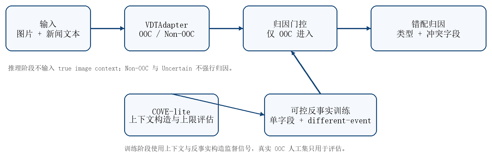
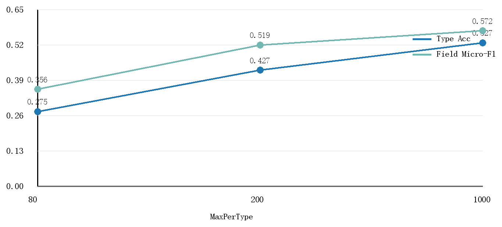
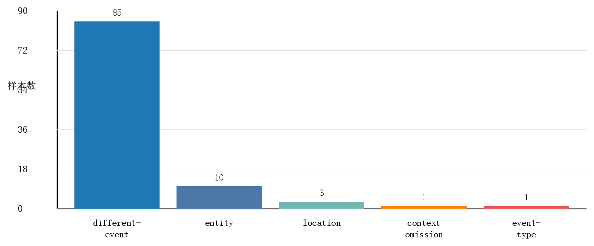
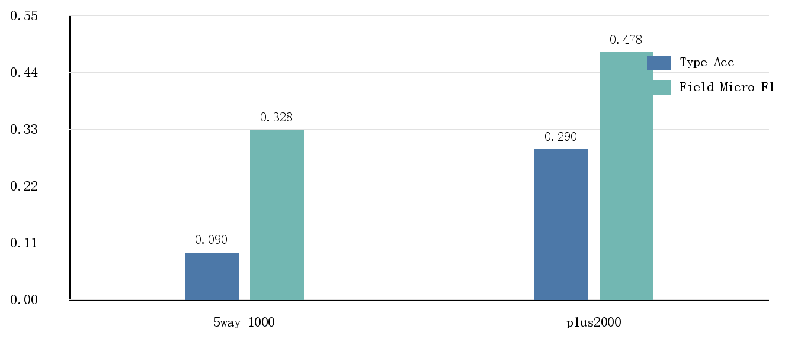

# 基于可控反事实训练的跨域图文内容挪用检测与错配归因方法

Counterfactual Attribution for Cross-Domain Out-of-Context Image-Text Misinformation Detection

作者：费思岳，陈宇欣，朱俊好，郭远重

## 摘要
真实新闻图片与错误文本语境重新配对后，可以在不修改像素的条件下改变事件含义。现有跨域 OOC 检测模型多输出 OOC/Non-OOC 标签，能够判断图文是否错配，却难以定位主体、地点、时间、事件类型或行为关系中的冲突字段。本文在 VDT 跨域检测基线上研究 no-true-context 条件下的错配归因问题：推理阶段只输入图片和当前文本，不输入图片原始新闻上下文。
本文采用主分类与归因解耦的协议。VDT 负责 OOC 主分类，归因头只在 OOC 条件下预测 mismatch type 与 conflict fields；Non-OOC 或证据不足样本不生成强归因。由于 NewsCLIPpings 仅提供二分类标签，本文利用 VisualNews 原始上下文构造 COVE-lite oracle 链路，用于样本构造和上限分析；同时从 Non-OOC 样本生成 entity、location、time 单字段反事实，并从原始 OOC 中筛选低相似、低重叠的 different-event 样本。
VDT strict BLIP-2/GaussianBlur 复现在 bbc,guardian 目标域取得 F1 0.7353、Acc 0.7383、AUC 0.7398，在 usa_today,washington_post 目标域 batch size 64 设置下取得 F1 0.8032、Acc 0.8032、AUC 0.8028。no-true-context 归因头在 MaxPerType=80/200/1000 三组反事实训练中，Type Acc 从 0.2745 升至 0.5275，Field Micro-F1 从 0.3564 升至 0.5719。加入 2000 条 filtered different-event 候选后，合成测试集 Field Micro-F1 为 0.6876；真实 OOC 100 条上 Field Micro-F1 从 0.3276 升至 0.4781，Exact Match 仍为 0.0300。人工标注显示真实 OOC 中 different-event 占 85%，且常与多个字段共现，说明归因误差主要来自多字段事件结构恢复，而不是单字段替换模式本身。

关键词：内容安全；图文内容挪用；Out-of-Context misinformation；VDT；可控反事实；错配归因

## 1 引言

Out-of-Context 图文内容挪用将真实图片与错误文本组合到同一叙事中。旧图新用、同主体不同事件、同主题跨地点配图和灾害现场错误引用都属于该类风险。图像和文本可以分别真实，误导来自二者绑定到不同事件。高语义相似的 hard negative 使相似度匹配不足以承担事实一致性判断。

内容安全审核需要两个层次的输出：图文是否属于同一事件，以及不一致时冲突发生在哪些事件字段。前者对应 OOC 二分类，后者对应可审计的错配归因。本文围绕三个可检验问题展开：VDT strict 设置在本地硬件约束下能否复现跨域检测结果；no-true-context 推理中，归因头能否从可控反事实中学习字段冲突；真实 OOC 的错配结构是否仍能由单字段反事实解释。

本文的主要贡献有三点。第一，复现 VDT strict BLIP-2/GaussianBlur 两组跨域实验，并记录 batch size 受显存约束后的可运行设置。第二，构建 VDT-CF-Attr 后置归因协议，使 mismatch type 和 conflict fields 在 OOC 门控下输出，不覆盖主分类。第三，构造单字段反事实与 filtered different-event 训练集，并用 100 条真实 OOC 人工样本检验合成分布到真实分布的变化。

## 2 相关工作

NewsCLIPpings 基于 VisualNews 重新配对真实新闻图片和文本，形成 OOC 检测基准。该数据集刻画“真实图像 + 错误文本语境”的误导传播，但标签粒度停留在 OOC/Non-OOC。VisualNews 保存图片原始新闻上下文，因此可以为错配字段构造提供参照。

跨域 OOC 检测关注新闻机构、话题和写作风格变化下的泛化。VDT 通过变分域不变表示和测试时训练缓解域偏移，适合作为主分类基线。解释型 OOC 研究进一步引入外部证据或图像原始上下文，代表工作包括 SNIFFER 和 COVE。这类方法表明，语境一致性需要比较事件主体、地点、时间和关系，而不是只比较图文相似度。

相似度 shortcut 仍可能在 OOC benchmark 中形成强信号，尤其在负样本构造规则固定时。本文将检测分数、错配字段和真实事件一致性分开评估：VDT 用于主分类，COVE-lite 用于构造和 oracle 分析，最终归因头只使用 image+caption 输入。

表1  数据来源与评价对象

|数据源|原始标签|使用环节|
|---|---|---|
|NewsCLIPpings|OOC/Non-OOC|VDT 复现、反事实构造、真实 OOC 抽样|
|VisualNews|图像原始上下文|COVE-lite oracle、人工标注参考|
|人工 OOC 100 条|mismatch type；conflict fields|真实归因评估|

注：NewsCLIPpings 原始标签不包含错配字段，本文只把人工标注作为真实归因评估依据。

## 3 方法

给定图片 I 与当前新闻文本 T，VDTAdapter 输出主分类 y。若 y 为 OOC，归因头 h_attr(I,T) 输出错配类型 a 和冲突字段集合 F；若 y 为 Non-OOC，系统输出 benign；若 y 为 Uncertain，系统输出 evidence insufficient。该门控结构防止归因模块覆盖主分类结果。

COVE-lite 链路通过 image_id 找到 VisualNews 原始上下文 C，并比较 T 与 C 的事件字段。该链路不进入最终推理输入，用于构造反事实样本、分析 oracle 上限和辅助人工标注。事件字段包括 entity、location、time、event_type 和 relation。

可控反事实样本从 Non-OOC 图文对生成。保持图片不变，只替换文本中的实体、地点或年份字段，分别标记为 entity mismatch、location mismatch 和 temporal mismatch。正常样本标为 benign illustrative image。对原始 OOC 样本，只选择低文本相似度、低 token 重叠且不与人工评估集重合的样本作为 different-event 候选。

no-true-context 归因头的输入特征由图文相似度、字段 prompt grounding、文本字段存在性和 VDT score 组成。训练候选包括规则基线、logistic regression 与多层感知机。默认模型由测试集 Type Acc、Field Micro-F1 和 Exact Match 综合选择。

表2  归因标签与训练来源

|标签|样本来源|监督性质|
|---|---|---|
|benign|Non-OOC 原样本|原始匹配样本|
|entity|实体替换|单字段反事实|
|location|地点替换|单字段反事实|
|temporal|年份替换|单字段反事实|
|different-event|筛选原始 OOC|弱监督候选|

注：different-event 样本在 plus2000 设置中排除了人工 100 条评估集。

图1  VDT-CF-Attr 的训练与推理结构

图1给出主分类、归因门控和反事实训练之间的关系。推理阶段不读取 true image context；COVE-lite 只参与训练构造、oracle 分析和人工标注参考。

## 4 实验设置

实验分为四组。第一组复现 VDT strict BLIP-2/GaussianBlur 跨域检测结果。第二组构造 COVE-lite context pairs 并检查字段抽取覆盖率。第三组在 no-true-context 设置下比较反事实训练规模。第四组在真实 OOC 人工 100 条上评估归因泛化。

主要指标包括 Type Acc、Field Micro-F1 和 Exact Match。Type Acc 评价主错配类型是否正确；Field Micro-F1 评价冲突字段集合；Exact Match 要求类型和字段同时匹配。真实 OOC 的 Exact Match 更严格，因为 different-event 样本常同时涉及多个字段。本文列出点估计和误差分布，不把单次课程实验结果写成统计显著性结论。

表3  VDT strict baseline 复现结果

|目标域|Batch|F1|Acc|AUC|记录|
|---|---|---|---|---|---|
|bbc, guardian|128|0.7353|0.7383|0.7398|完成|
|usa_today, washington_post|128|-|-|-|CUDA OOM|
|usa_today, washington_post|64|0.8032|0.8032|0.8028|完成|

注：usa_today,washington_post 在 batch size 128 下受显存限制，后续分析采用 batch size 64 的完成结果。

表4  COVE-lite 构造与字段覆盖

|检查内容|数值|
|---|---|
|扫描 JSON 文件|15|
|可用样本数|1430560|
|本次保留样本|3000|
|missing id/text/context|0 / 0 / 0|
|current entity/location/time|500 / 292 / 152|
|current event_type/relation|154 / 172|

注：字段覆盖率用于判断 true-context oracle 分析的可比范围，不代表最终在线推理输入。

## 5 结果与分析

反事实训练规模直接影响 no-true-context 归因效果。MaxPerType 从 80 增至 1000 时，logistic regression head 的 Type Acc 从 0.2745 提升到 0.5275，Field Micro-F1 从 0.3564 提升到 0.5719。单字段反事实提供了可学习的字段冲突信号，但 1000 设置中的 location 样本只有 797 条，反映出字段可抽取样本不完全均衡。

加入 different-event 类后，5way_1000 设置的 logistic regression 得到 Type Acc 0.4011 和 Field Micro-F1 0.5841。plus2000 设置将 different-event 训练样本增加到 3000 条，默认模型变为 image+caption MLP，合成测试集 Type Acc 为 0.5220，Field Micro-F1 为 0.6876。该变化与人工标注发现一致：真实 OOC 主要不是单字段替换，而是多字段事件冲突。

表5  no-true-context 反事实训练规模结果

|MaxPerType|训练分布|方法|Type Acc|Field F1|Exact|
|---|---|---|---|---|---|
|80|80/80/80/80/0|LR|0.2745|0.3564|0.1961|
|200|200/200/200/200/0|LR|0.4266|0.5195|0.2308|
|1000|1000/797/1000/1000/0|LR|0.5275|0.5719|0.3250|

注：训练分布顺序为 none/location/time/entity/different-event；LR 表示 logistic regression no-true-context。

表6  five-class 与 plus2000 合成测试

|设置|训练分布|选中模型|N|Type Acc|Field F1|Exact|
|---|---|---|---|---|---|---|
|5way_1000|1000/1000/1000/1000/987|LR|703|0.4011|0.5841|0.3257|
|plus2000|1000/1000/1000/1000/3000|MLP|998|0.5220|0.6876|0.3487|

注：训练分布顺序为 none/entity/location/time/different-event；MLP 为 image+caption attribution head。

图2  no-true-context 归因头随训练规模变化

图2显示反事实训练样本增加后，Type Acc 和 Field Micro-F1 同时提高。该趋势只支持受控反事实分布下的学习效果，不推出真实 OOC 已被完全覆盖。

## 6 真实 OOC 人工评估

人工评估集包含两批共 100 条真实 OOC 样本。标注对象为 current caption 与 true image context 的错配类型和冲突字段；标注时保留图文内容、原始上下文和候选字段，不使用模型预测作为主统计依据。本轮数据完成规范化单人标注，未形成双人独立盲审、Cohen's kappa 或第三人仲裁，因此人工集用于真实分布评估和误差定位，不用于显著性检验。

类型分布中 different-event mismatch 为 85 条，entity mismatch 为 10 条，location mismatch 为 3 条，context omission 和 event-type mismatch 各 1 条。字段分布中 entity 为 94，event_type 为 74，relation 为 69，location 为 57，time 为 33。该分布说明真实 OOC 多数同时涉及多个字段。

plus2000 模型在真实 OOC 上将 Type Acc 从 0.0900 提高到 0.2900，Field Micro-F1 从 0.3276 提高到 0.4781。Exact Match 仍为 0.0300，说明模型能恢复部分字段，但尚不能稳定给出完整事件冲突集合。

表7  真实 OOC 人工 100 条分布

|类别|数量|
|---|---|
|different-event|85|
|entity|10|
|location|3|
|context omission|1|
|event-type|1|

注：字段分布为 entity 94、event_type 74、relation 69、location 57、time 33，存在多字段共现。

表8  真实 OOC 100 条 no-true-context 评估

|模型|Type Acc|Field F1|Exact|主要预测|
|---|---|---|---|---|
|5way_1000|0.0900|0.3276|0.0300|entity 40；temporal 28；benign 26|
|plus2000|0.2900|0.4781|0.0300|entity 44；different-event 33；temporal 14|

注：Field F1 为 conflict field micro-F1；主要预测只列高频类别。

图3  真实 OOC 人工标注类型分布

图3显示 different-event 在人工 100 条中占 85%。因此，单字段反事实只覆盖真实分布的一部分，训练集中需要包含多字段或跨事件错配样本。

图4  plus2000 在真实 OOC 评估中的变化

图4显示 plus2000 设置提高了 Type Acc 和 Field Micro-F1。Exact Match 未同步提高，说明当前模型仍偏向预测部分字段，完整归因仍需更强事件表示和更多人工标注。

## 7 原型系统

实现部分采用 Gradio 单页界面承载推理流程。输入为图片和新闻文本，输出包括 OOC 判定、归因类型、冲突字段和证据状态。服务启动时自动选择可用端口并执行模型预热；缺少训练产物或 CLIP 依赖时返回 evidence insufficient，避免把缺失特征解释为高置信 benign。

复现实验和轻量推理分离。运行界面只需要源码、Python 依赖和轻量模型产物；重新训练或复现 VDT 需要 VisualNews、NewsCLIPpings、VDT/BLIP-2 checkpoint 及本地路径配置。

表9  实现检查

|检查项|结果|
|---|---|
|编译检查|demo/app.py 与推理脚本通过|
|单元测试|pytest -q：16 passed|
|结构检查|check_project.py：OK|
|最终检查|check_final_deliverables.py：OK|
|HTTP 访问|Gradio 页面返回 200 OK|

## 8 讨论

第一，原始 OOC 不能全部标为 different-event。抽查样本中存在同一人物不同活动、同类体育比赛错配、同主题政治报道错配等 hard negative。本文只把严格筛选的低相似样本作为 weak different-event 训练样本，并用人工集评估真实泛化。

第二，true-context oracle 与 no-true-context 推理需要分开解释。COVE-lite 能利用 VisualNews 原始上下文，因此适合分析上限和构造监督；在线系统只使用 image 与 current caption，指标较低符合输入信息减少后的任务难度。

第三，真实 OOC 的 Exact Match 仍低。人工标注显示 different-event 常与 entity、event_type、relation、location、time 多字段共同出现。当前 prompt grounding 和图文相似度特征能捕捉部分字段，不足以稳定恢复完整事件结构。

## 9 结论

本文得到三点发现。第一，VDT strict baseline 可以在本地显存约束下完成核心复现，batch size 变化需要随结果一并记录。第二，可控反事实样本能为 no-true-context 归因头提供字段监督，训练规模增加后 Type Acc 和 Field Micro-F1 均提高。第三，真实 OOC 的主体、事件类型、关系、地点和时间常共同变化，plus2000 different-event 样本能改善部分字段预测，但完整 Exact Match 仍低。

这一结果要求后续研究同时控制主分类、归因标签和真实事件结构。可执行方向包括扩大人工归因标注、引入双人盲审与第三人仲裁、构造 image_A + caption_B 的严格跨事件反事实样本、补充 OCR/NER/captioning 特征，并在不降低 VDT 主分类性能的条件下研究事件字段与主分类的受控融合。

## 10 作者贡献

费思岳参与数据路径整理和 VDT strict 复现配置核对，记录 NewsCLIPpings/VisualNews 数据状态、目标域设置和显存约束下的 batch size 调整。

陈宇欣参与真实 OOC 样本检查、错配字段定义和人工标注表整理，支持 different-event 与多字段共现的案例分析。

朱俊好负责研究路线、核心实现与实验集成，包括 VDT 接入、COVE-lite 构造、可控反事实训练、plus2000 评估和 no-true-context 推理系统。

郭远重参与展示材料和复现说明整理，协助准备演示样例、答辩材料和轻量运行环境说明。

## 11 数据、代码与补充材料可用性声明

本研究代码、实验脚本、配置说明和轻量演示材料整理在课程项目仓库中。NewsCLIPpings、VisualNews 和 VDT/BLIP-2 checkpoint 按原数据集和模型许可获取，不随本文重新分发。人工评估表仅保留样本编号、字段标签和必要文本上下文，提交版本不包含额外个人信息。

## 参考文献
[1] Luo G, Darrell T, Rohrbach A. NewsCLIPpings: Automatic Generation of Out-of-Context Multimodal Media. EMNLP, 2021.
[2] Liu F, Wang Y, Wang T, Ordonez V. Visual News: Benchmark and Challenges in News Image Captioning. EMNLP, 2021.
[3] Radford A, Kim J W, Hallacy C, et al. Learning Transferable Visual Models From Natural Language Supervision. ICML, 2021.
[4] Yang X, Zhang H, Lin Z, Hu Y, Han H. Out-of-Context Misinformation Detection via Variational Domain-Invariant Learning with Test-Time Training. AAAI, 2026.
[5] Qi P, Yan Z, Hsu W, Lee M L. SNIFFER: Multimodal Large Language Model for Explainable Out-of-Context Misinformation Detection. CVPR, 2024.
[6] Tonglet J, Thiem G, Gurevych I. COVE: COntext and VEracity prediction for out-of-context images. NAACL, 2025.
[7] Hugging Face. Transformers Documentation: CLIPModel and BART MNLI APIs.
[8] Gradio Team. Gradio Documentation: Blocks, JSON, HTML components and queue configuration.